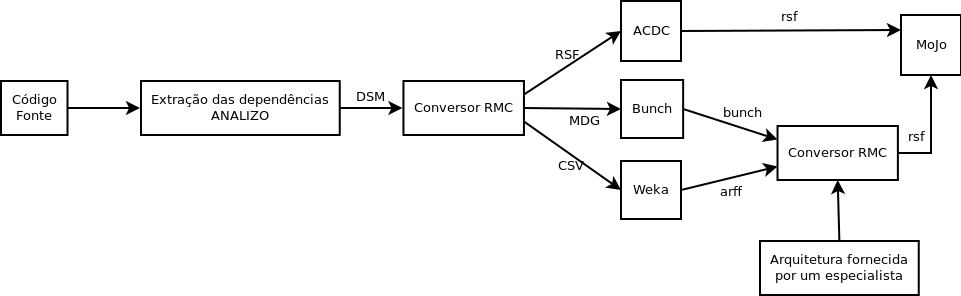

# Conversor RMC

O Conversor RMC (um acrônimo para RSF, MDG e CSV) é um conversor para DSM em HTML desenvolvido para auxiliar na execução de algoritmos utilizados para a recuperação de arquitetura:

* ACDC
* Bunch
* LIMBO
* MoJo

Abaixo é apresentado uma imagem que mostra o fluxo de execução do trabalho realizado e os momentos em que são utilizados o conversor.

### Formato RSF

O formato RSF é o formato gerado pela ferramenta Rigi Editor utilizado para  representar os diversos tipos de relacionamentos entre os elementos de um sistema. Seu formato está representado abaixo.

**RelationshipType** *Module1 Module2*

Em RelationshipType representa o tipo do relacionamento (contain, call, depend, etc) entre Module1 e Module2 e estes representam os elementos do sistemas.  Para este trabalho foi considerado apenas o tipo depend para representar a  dependência entre os módulos 1 e 2, isto é, o elemento 1 depende do módulo 2,  como apresentado abaixo.

**depend** *Module1 Module2*

Também é possível representar agrupamentos de um sistema utilizando o formato RSF.  Para isso, é necessário que o tipo de relacionamento seja contain e o Module1 deve  representar um cluster. Um cluster é representado com o sufixo .ss ao final do nome 
do módulo.

**contain** *Cluster.ss Module2*

Esse formato tem como relacionamento o valor contain que significa que o Cluster.ss contém o elemento Module2. O formato RSF é requerido pelas ferramentas ACDC e MoJo.  A primeira ferra menta tem como input e output arquivos de formato RSF. Como entrada  o arquivo deve ter relacionamento depend expressando o relacionamento de dependência entre as entidades do sistema. A saída gerada pela ferramenta é um arquivo de mesmo  formato contendo o agrupamento do sistema. A segunda ferramenta, MoJo, tem como inputs  dois arquivos de formato RSF representando agrupamentos.
 
O primeiro arquivo deve ser a saída gerada por algum algoritmo de agrupamento e o  segundo deve ser um agrupamento realizado por um especialista. A saída gerada pela  métrica é um número inteiro positivo expressando a quantidade mínima de operações  necessárias para se transformar o primeiro agrupamento no segundo.

### Formato Bunch

O formato de entrada exigido pela ferramenta Bunch para representar as dependências de cada elemento do sistema é uma 4-tupla. Cada uma, possui 4 campos, dos quais os dois primeiros são os módulos, o terceiro, opcional, é o peso para a relação entre os módulos e o último, também opcional, representa o tipo de relação entre os módulos. Quando não há definição das ponderações ou o tipo dos relacionamentos, significa que todos os tipos de relacionamento possuem mesma ponderação igual a 1.

**Module1 Module2** *[RelationshipType [RelationshipType]]*

Para a realização deste trabalho não foram especificados os tipos de relacionamento e todas os relacionamentos possuem o mesmo peso. Portanto o formato de entrada para a ferramenta, representa apenas relação de dependência do módulo 1 para com o módulo 2.

**Module1 Module2**

Assim, como foi definido o formato de entrada, há uma dependência entre o módulo 1 e o módulo 2, ou seja, o módulo 1 depende do módulo 2. Neste trabalho, usando os scripts desenvolvidos, esse formato é gerado a partir da DSM seguindo as definições apresentadas anteriormente em que as dependências da DSM são traduzidas para o formato usado pela ferramenta Bunch.

Ao realizar o agrupamento, a ferramenta Bunch gera um arquivo .bunch que representa o resultado do agrupamento [33], isto é, os clusters gerados e os elementos contidos nesses clusters, representado abaixo.

*SS(ModuleName) = elemento1, elemento2, ..., elementoN*

Como apresentado anteriormente, a ferramenta MoJo utiliza o formato RSF como input, portanto, fez-se necessário a conversão do tipo .bunch para o tipo .rsf.

Assim, após a conversão, o arquivo RSF gerado terá o seguinte formato:

* **contain** *ModuleName.ss elemento1*
* **contain** *ModuleName.ss elemento2*
* ...
* **contain** *ModuleName.ss elementoN*

### Formato CSV

Esse formato é um dos vários formatos utilizados pela ferramenta Weka para a utilização de algoritmos de categorização, agrupamento, associação e regressão. Utilizando os scripts desenvolvidos, converteu-se os dados contidos na DSM para o
formato CSV. Onde há dependência entre os elementos na DSM é representado como 1 em CSV e 0 caso contrário.
